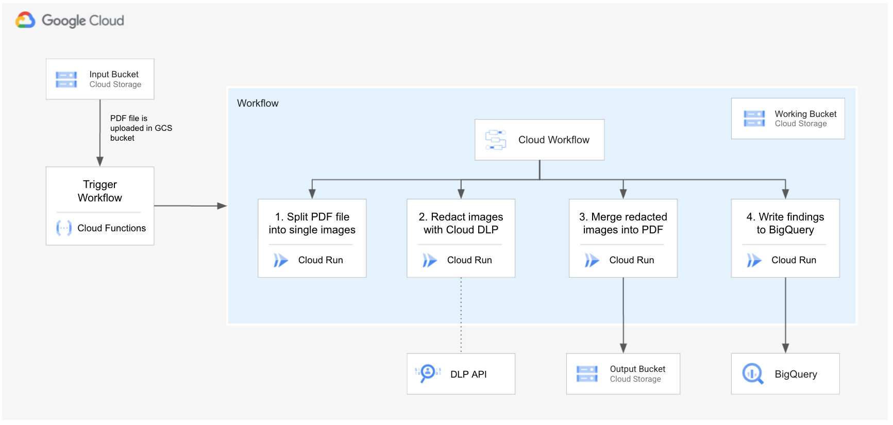

# Data-Loss-Protection-PDF-Converter-
Sistema per anonimizzare i pdf che vengono caricati su un bucket 

This solution enables the automatic anonymization of sensitive data in PDF files using serverless Google Cloud services.

The process works as follows:
1. The file(s) is uploaded to an input bucket.
2. Once uploaded, it triggers a Cloud Function that invokes an API running on Cloud Run.
3. The Cloud Run API performs the following tasks:
   3.1 Splits the PDF into individual images, one per page.
   3.2 Calls the DLP API for each image to remove sensitive information.
   3.3 Merges the redacted images into a single PDF and uploads it to an output bucket.
   3.4 Stores the findings in BigQuery.

Mi sono inspirato al seguente progetto: https://github.com/GoogleCloudPlatform/dlp-pdf-redaction   
Per farlo funzionare ho dovuto apportare alcune modifiche, in particolare ai file 
- workflow-trigger.tf
- dlp-runner.tf

In questi file mancava la creazione del service-account e quindi ho aggiunto questi elementi nel tf (resource).

## Solution Architecture Diagram

## Code to be lanched

#Get the code
#Clone this github repository go to the root of the repository.
git clone https://github.com/GoogleCloudPlatform/dlp-pdf-redaction
cd dlp-pdf-redaction

#Build images for Cloud Run
#You will first need to build the docker images for each microservice.
PROJECT_ID=$(gcloud config get-value project)
PROJECT_NUMBER=$(gcloud projects list --filter="PROJECT_ID=$PROJECT_ID" --format="value(PROJECT_NUMBER)")

#REGION=$(gcloud storage buckets describe $(gsutil ls -p $PROJECT_ID) --format="value(location)")   #questa linea serve per scegliere la stessa regione usata per i bucket già presenti nel progetto, se ci fossero
REGION=us-west1

DOCKER_REPO_NAME=pdf-redaction-docker-repo
CLOUD_BUILD_SERVICE_ACCOUNT=cloudbuild-sa

#Enable required APIs
gcloud services enable cloudbuild.googleapis.com artifactregistry.googleapis.com --project $PROJECT_ID

#Create a Docker image repo to store apps docker images
gcloud artifacts repositories create $DOCKER_REPO_NAME --repository-format=docker --description="PDF Redaction Docker Image repository" --project=$PROJECT_ID --location=$REGION
#Nota che il comando di sopra non funziona in alcuni quicklabs, dando errori stranissimi, invece sul mio progetto sul mio account personale funziona perfettamente.

#Create Service Account for CloudBuild and grant required roles
gcloud iam service-accounts create $CLOUD_BUILD_SERVICE_ACCOUNT \
  --description="Service Account for CloudBuild created by PDF Redaction solution" \
  --display-name="CloudBuild SA (PDF Readaction)"
gcloud projects add-iam-policy-binding $PROJECT_ID \
  --member="serviceAccount:$CLOUD_BUILD_SERVICE_ACCOUNT@$PROJECT_ID.iam.gserviceaccount.com" \
  --role="roles/cloudbuild.serviceAgent"
gcloud projects add-iam-policy-binding $PROJECT_ID \
  --member="serviceAccount:$CLOUD_BUILD_SERVICE_ACCOUNT@$PROJECT_ID.iam.gserviceaccount.com" \
  --role="roles/storage.objectUser"

#Build docker images of the app and store them in artifact registry repo
gcloud builds submit \
  --config ./build-app-images.yaml \
  --substitutions _REGION=$REGION,_DOCKER_REPO_NAME=$DOCKER_REPO_NAME \
  --service-account=projects/$PROJECT_ID/serviceAccounts/$CLOUD_BUILD_SERVICE_ACCOUNT@$PROJECT_ID.iam.gserviceaccount.com \
  --default-buckets-behavior=regional-user-owned-bucket \
  --project $PROJECT_ID

export TF_VAR_project_id=$PROJECT_ID
export TF_VAR_region=$REGION
export TF_VAR_wf_region=$REGION
export TF_VAR_docker_repo_name=$DOCKER_REPO_NAME

terraform -chdir=terraform init
terraform -chdir=terraform apply -auto-approve
#Nota che: 1. mi ha dato errore con due service accounts, li ho cancellati andando sulla Cloud Console. 2. Ho rilanciato il comando apply e mi ha dato un errore con eventarc. 3. Ho rilanciato apply mi ha dato nuovamente lo stesso errore, però la terza volta ha funzionato ed ho ottenuto il messaggio "Apply complete! 4. Non ho dovuto moficare per niente gli script dei tf.

#Take note of the Terraform Outputs
terraform -chdir=terraform output

# test
gsutil cp ./test_file.pdf [INPUT_BUCKET_FROM_OUTPUT e.g. gs://pdf-input-bucket-xxxx]

# Additional notes
Il seguente cloudskillboost training offre una soluzione per trasformare dei files google docx in pdf: https://www.cloudskillsboost.google/games/5979/labs/38169

# Explore results
Download the redacted pdf file, open it with your preferred pdf reader, and search for text in the PDF file.

Looking into Cloud Workflows in the GCP web console. You will see that a workflow execution was triggered when you uploaded the file to GCS.

Explore the pdf_redaction_xxxx dataset in BigQuery and check out the metadata that was inserted into the findings table.
